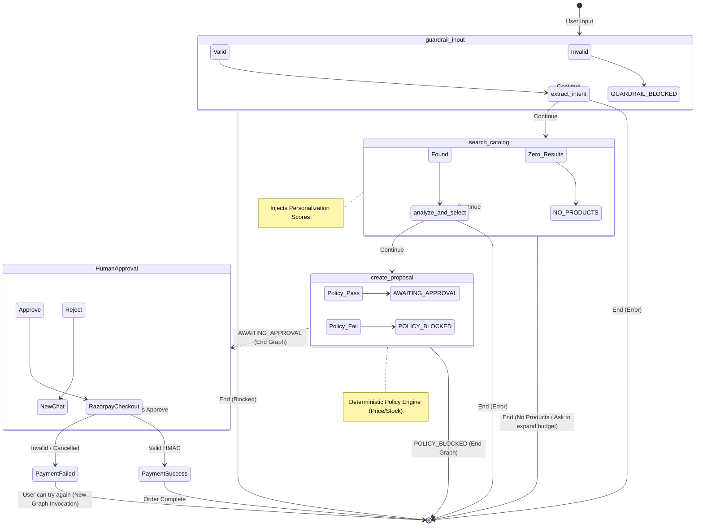
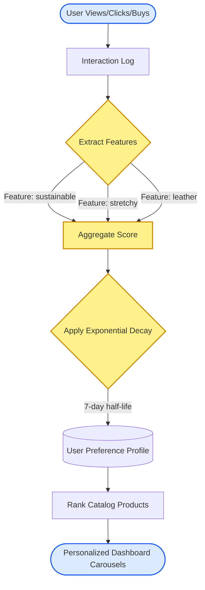
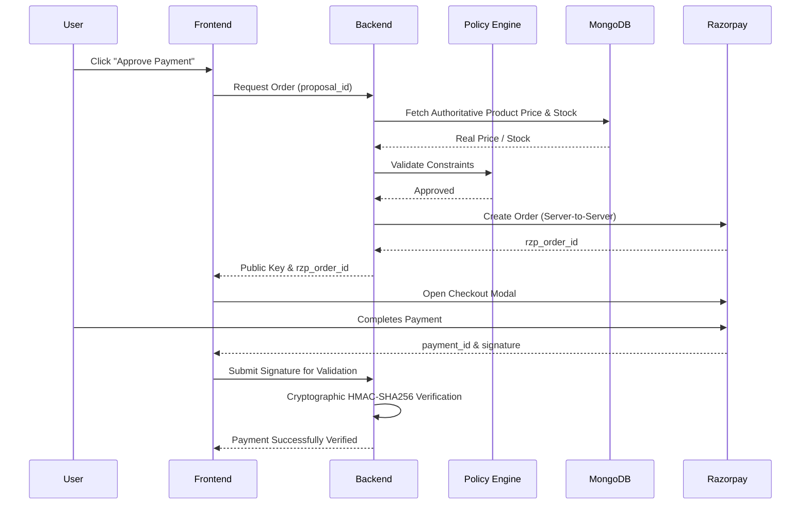

# AgentCart 🤖🛒 — Safe Agentic Commerce Platform

AgentCart is a fully functional, AI-powered e-commerce platform that demonstrates how to safely deploy large language models (LLMs) in high-stakes transactional environments. 

Instead of a traditional browsing experience, AgentCart introduces an **AI Shopping Assistant** that understands complex user queries, semantically searches the catalog, filters by budget and features, organically learns user preferences, and creates secure purchase proposals. 

To prevent AI hallucinations from causing financial harm, AgentCart surrounds the LLM with deterministic **Guardrails** and a **Policy Engine** that strictly controls the actual transaction.

---

## 🚀 Key Features

1. **Conversational Commerce**: Natural language product search and constraints extraction using LangGraph.
2. **Multi-Interest Personalization**: Organically learns user preferences via decay-based feature aggregation from clicks, views, and purchases. 
3. **Defense-in-Depth Architecture**: The AI can *propose* a purchase, but deterministic code controls the price and safety checks.
4. **Deterministic Policy Engine**: Blocks out-of-stock items, budget overruns, or quantity limits even if the AI hallucinates them.
5. **Secure Payment Flow**: Razorpay Test Mode integration with strict backend HMAC-SHA256 signature verification.
6. **Live Audit Trail**: Total transparency for the user to see every decision the LLM, Guardrails, and Policy engine make.

---

## 🧠 The Agent Flow

The AI Agent operates using a state graph (LangGraph) pipeline. The LLM never touches actual payment logic directly.



### 1. Guardrails & Safety First
- **Input Guardrails**: Scans raw user prompts for prompt injection, extreme discounts ("give me 99% off"), or inappropriate content.
- **Intent Extraction**: The LLM extracts a structured JSON intent (query, budget, features).
- **Intent Guardrails**: Validates the extracted JSON to ensure no rogue variables were injected.

### 2. Search & Personalization
- **Semantic DB Search**: Uses MongoDB native text search. The LLM does *not* invent products; it only sees what the DB returns.
- **Multi-Interest Ranking**: Items returned from the DB are scored against the user's decayed historical interaction profile.

### 3. Selection & Policy Check
- **Product Selection**: The LLM picks the best product from the DB results.
- **Policy Engine**: The backend reads the *authoritative price* from the database (ignoring whatever price the LLM thought it was) and runs deterministic checks:
  - Is it in stock?
  - Does it exceed the maximum system budget?
  - Does it exceed the user's stated budget?
  - Is the currency valid?

### 4. Human-in-the-Loop & Payments
- **Human Approval**: No payment is ever created without explicit user approval of the AI's proposal.
- **Payment Verification**: Only the backend can verify a Razorpay signature.

---

## 📂 Project Structure

```text
AI-Growth-Agentic-Commerce/
├── backend/
│   ├── app/
│   │   ├── agents/          # LangGraph pipeline, Prompts, State
│   │   ├── api/             # FastAPI Endpoints (Agent, Payments, Recs)
│   │   ├── core/            # Configuration and security settings
│   │   ├── db/              # MongoDB connection
│   │   ├── guardrails/      # Deterministic AI safety checks
│   │   ├── models/          # Pydantic schemas
│   │   └── services/        # Business Logic
│   │       ├── payment_service.py         # Secure Razorpay integration
│   │       ├── policy_service.py          # Deterministic purchase rules
│   │       ├── preference_service.py      # Feature aggregation & decay
│   │       ├── recommendation_ranker.py   # TF-IDF / Personalization scoring
│   │       └── recommendation_service.py  # Amazon-style multi-carousel logic
│   └── requirements.txt
├── frontend/
│   ├── src/
│   │   ├── api/             # Axios API clients
│   │   ├── components/
│   │   │   ├── agent/       # Chat UI and message rendering
│   │   │   ├── payment/     # Approval Modal & Razorpay script loader
│   │   │   ├── products/    # Product Cards
│   │   │   └── recommendations/ # Dynamic personalized carousels
│   │   ├── pages/           # Dashboard
│   │   └── App.jsx
│   ├── index.css            # Custom CSS & Glassmorphism styles
│   └── package.json
└── .env                     # Shared environment variables
```

---

## 🛠 Tech Stack

**Frontend**: React (Vite), TailwindCSS, React Router
**Backend**: FastAPI, LangGraph, LangChain, Python 3
**Database**: MongoDB Atlas
**AI Providers**: Google Gemini (Primary), Groq (Fallback)
**Payments**: Razorpay (Test Mode)

---

## 🧠 The Personalization Engine Deep-Dive

AgentCart implements a sophisticated **Multi-Interest Personalization Engine** modeled after top-tier e-commerce platforms.

Instead of just tracking the *last* thing a user clicked, it breaks down products into their constituent **features** (e.g., `wireless`, `noise cancellation`, `sustainable`, `dry-fit`) and aggregates a running score for those features.

* **Exponential Decay**: An interaction today is worth full points, but its value decays over a 7-day half-life. A click from 2 weeks ago matters much less than a click from 5 minutes ago.
* **Weighted Interactions**: Buying a product (`10 points`) heavily outweighs just viewing a product (`1 point`).
* **Multi-Interest Retention**: Because it tracks features rather than just categories, if you buy a pair of *Shoes*, the system learns you like `leather` and `durable`. If you later search for a *Jacket*, it will actively prioritize jackets that are also `leather` and `durable`.

The result is surfaced in three distinct Recommendation Carousels:
1. **Recommended For You** (Based on aggregate profile)
2. **Based on Your Recent Activity** (Similarity to immediate last click)
3. **Complements Your Recent Purchases** (Cross-sell mapping, e.g., Shoes -> Socks)



---

## 🔒 Secure Payment & Policy Flow

AgentCart ensures that no financial transaction can be manipulated by the LLM or frontend bypassing.


